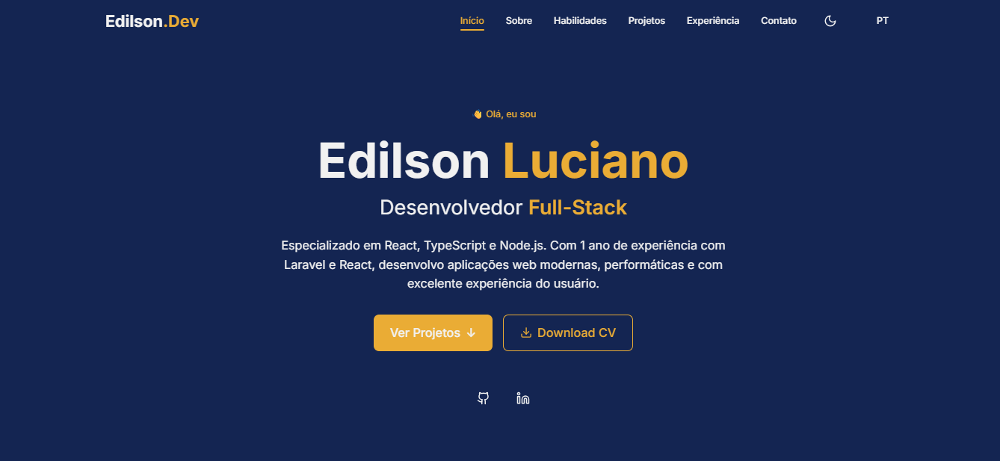
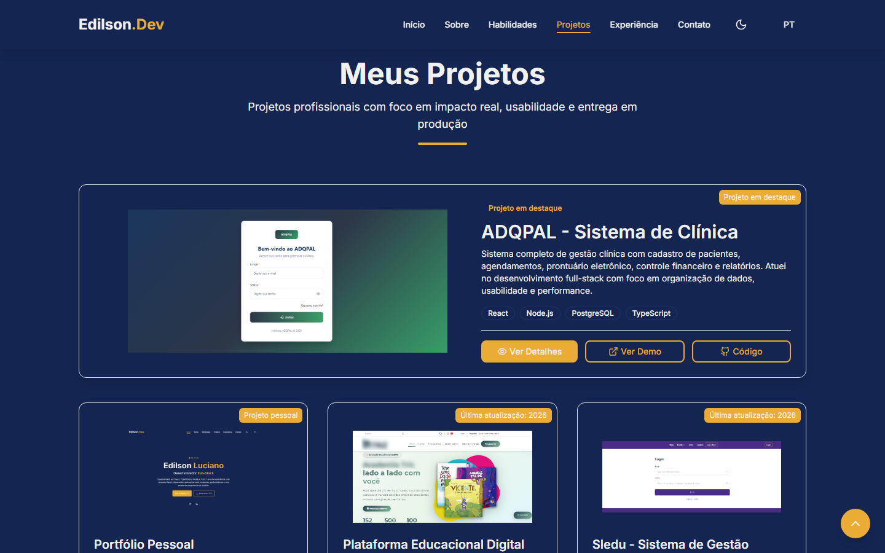
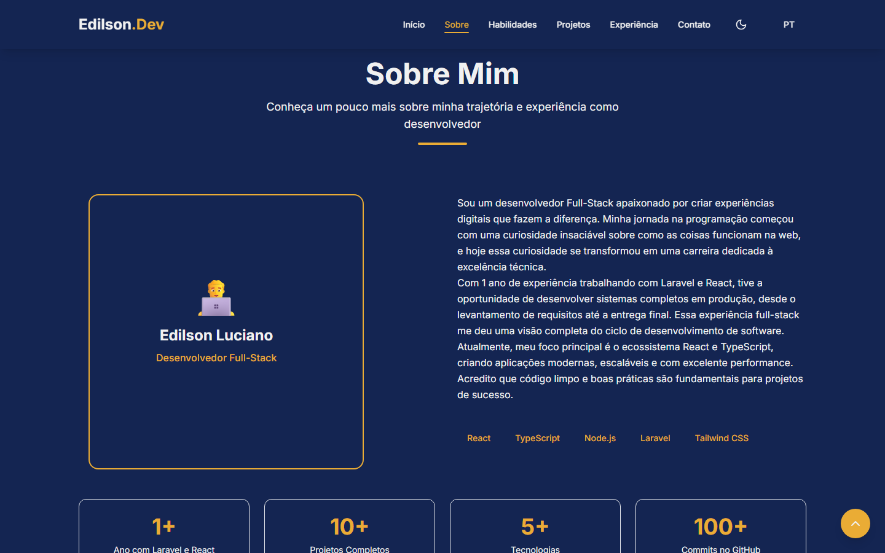
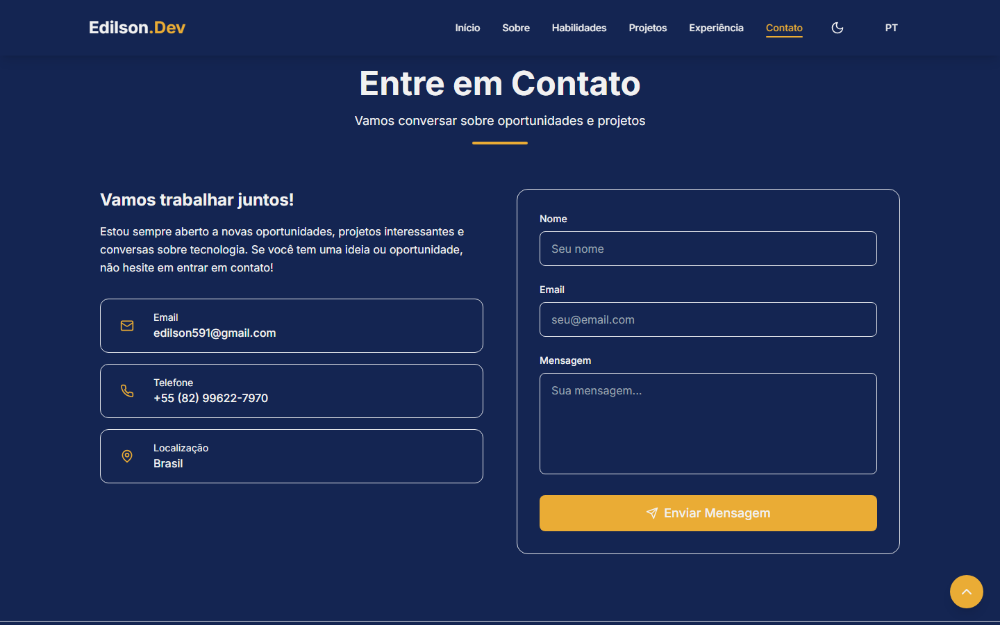

# Edilson.Dev

Portfólio pessoal de Edilson Luciano, desenvolvido para apresentar minha trajetória como desenvolvedor Full-Stack, principais habilidades, experiências profissionais, projetos em destaque e canais de contato.

🔗 **Acesse o projeto online:** [devedilson.com.br](https://devedilson.com.br/)



## Sobre o Projeto

Este projeto foi criado com foco em performance, responsividade e boa experiência do usuário. A interface conta com animações suaves, alternância entre tema claro e escuro, suporte a português e inglês, seção de projetos com modal de detalhes e formulário de contato integrado ao EmailJS.

## Funcionalidades

- Layout responsivo para desktop, tablet e mobile
- Tema claro e escuro com persistência no navegador
- Tradução entre português e inglês
- Seções de início, sobre, habilidades, projetos, experiência e contato
- Cards de projetos com imagens, detalhes, demo e código-fonte
- Modal com galeria de imagens dos projetos
- Animações com Framer Motion
- Formulário de contato integrado ao EmailJS
- Download de currículo em PDF

## Tecnologias

- React
- TypeScript
- Vite
- Tailwind CSS
- Framer Motion
- Lucide React
- EmailJS
- React Toastify

## Preview

| Início | Projetos |
| --- | --- |
|  |  |

| Sobre | Contato |
| --- | --- |
|  |  |

## Estrutura do Projeto

```text
src/
  components/
    layout/       Componentes de estrutura, como Navbar, Footer e Container
    shared/       Componentes reutilizáveis, cards, título de seção e modal
    ui/           Componentes de interface, botões, badges, toast e toggles
  context/
    Transalation/ Contexto e textos de tradução PT/EN
  data/           Dados de projetos, habilidades e experiências
  hooks/          Hooks de tema, seção ativa e posição de scroll
  sections/       Seções principais da página
  styles/         Estilos globais e variáveis de tema
  types/          Tipagens TypeScript
  utils/          Funções utilitárias
```

## Como Executar Localmente

Clone o repositório:

```bash
git clone https://github.com/Edilson591/Edilson.Dev.git
```

Acesse a pasta do projeto:

```bash
cd Edilson.Dev
```

Instale as dependências:

```bash
npm install
```

Crie um arquivo `.env` na raiz do projeto com as variáveis do EmailJS:

```env
VITE_EMAILJS_SERVICE_ID=seu_service_id
VITE_EMAILJS_TEMPLATE_ID=seu_template_id
VITE_EMAILJS_PUBLIC_KEY=sua_public_key
```

Inicie o servidor de desenvolvimento:

```bash
npm run dev
```

Acesse no navegador:

```text
http://localhost:5173
```

## Scripts

- `npm run dev`: inicia o servidor de desenvolvimento
- `npm run build`: gera a versão de produção em `dist/`
- `npm run lint`: executa a análise do ESLint
- `npm run preview`: executa uma prévia local da build de produção

## Build

Para gerar a versão de produção:

```bash
npm run build
```

Os arquivos finais serão gerados na pasta `dist/`.

## Variáveis de Ambiente

O formulário de contato usa EmailJS. Configure as variáveis abaixo no arquivo `.env`:

- `VITE_EMAILJS_SERVICE_ID`
- `VITE_EMAILJS_TEMPLATE_ID`
- `VITE_EMAILJS_PUBLIC_KEY`

O arquivo `.env` está no `.gitignore` e não deve ser enviado para o GitHub.

## Autor

**Edilson Luciano**

- Site: [devedilson.com.br](https://devedilson.com.br/)
- GitHub: [@Edilson591](https://github.com/Edilson591)
- LinkedIn: [edilsonluciano](https://www.linkedin.com/in/edilsonluciano/)
